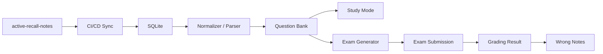

# active-recall-quiz

<div align="center">

### External notes become a searchable question bank

[](https://nextjs.org/)
[](https://react.dev/)
[](https://fastapi.tiangolo.com/)
[](https://www.typescriptlang.org/)
[](https://www.python.org/)

이 프로젝트는 별도 저장소 `active-recall-notes`에 있는 Markdown 노트를  
CI/CD로 수집해 이 앱의 SQLite에 적재하고,  
그 데이터를 바탕으로 문제 생성, 시험, 채점, 오답 복습 흐름을 제공합니다.

</div>

---

## Why This Project

학습 노트와 문제 풀이가 같은 저장소에 묶여 있으면 다음 문제가 생깁니다.

- 노트와 애플리케이션의 책임이 섞입니다.
- 콘텐츠 갱신과 앱 배포 주기가 충돌합니다.
- 로컬 Markdown 폴더에 의존하면 데이터 관리가 분산됩니다.

이 저장소는 그 흐름을 분리합니다.

> `active-recall-notes -> CI/CD sync -> SQLite -> question bank -> exam session -> grading -> wrong notes`

즉, 콘텐츠는 별도 레포에서 관리하고, 이 앱은 그 데이터를 읽어 학습 경험을 제공하는 역할에 집중합니다.

## Architecture



## Highlights

- Markdown 노트는 이 저장소가 아니라 `active-recall-notes`에서 관리합니다.
- CI/CD 파이프라인이 외부 노트를 수집해 SQLite에 적재하는 흐름을 전제로 합니다.
- FastAPI가 시험 생성, 제출, 채점 API를 제공합니다.
- Next.js App Router 기반 화면에서 학습, 시험, 결과, 오답노트를 확인합니다.
- 오답 결과는 프론트엔드 로컬 스토리지에 저장해 재복습할 수 있습니다.

## Repository Scope

이 저장소의 책임은 콘텐츠 작성이 아니라, 이미 수집된 노트를 학습 가능한 서비스로 바꾸는 것입니다.

- `backend`: 데이터 적재, 질문 생성, 시험, 채점, 통계 API
- `frontend`: 학습/시험/결과/오답노트 UI
- `shared`: 공용 계약이나 산출물
- `active-recall-notes`: 원본 Markdown 노트 저장소

## Project Structure

```text
.
├── backend                 # FastAPI API, SQLite access, grading logic
│   ├── app
│   │   ├── api             # REST endpoints
│   │   ├── parsers         # markdown normalization / ingestion helpers
│   │   ├── schemas         # pydantic models
│   │   ├── services        # question / exam / grading / stats
│   │   └── utils           # ids, text normalization
│   └── tests               # parser / grading tests
├── frontend                # Next.js UI
│   └── src
│       ├── app             # routes
│       ├── components      # UI components
│       └── lib             # API client, types, wrong-note storage
└── shared/openapi.json     # shared contract placeholder
```

## Data Model

- Source of truth: `active-recall-notes`
- Synchronized storage: SQLite in this repository
- Runtime API: FastAPI reads from SQLite and serves normalized question data
- Client-side cache: browser `localStorage` for wrong notes

## Key Screens

### 1. Home
- 수집된 단원과 파싱된 문제 수를 요약해서 보여줍니다.
- 학습 모드, 시험 모드, 오답노트로 바로 이동할 수 있습니다.

### 2. Study Mode
- 문제를 먼저 보고 답을 떠올린 뒤 정답을 확인하는 흐름입니다.
- 현재는 빠른 검증용 초기 버전이라 정답이 함께 노출됩니다.

### 3. Exam Mode
- 단원과 파트를 고른 뒤 시험 세트를 생성합니다.
- 생성된 문제를 서술형으로 입력하고 한 번에 제출합니다.

### 4. Result + Wrong Notes
- 정답 여부, 점수, 누락 키워드 중심으로 결과를 확인합니다.
- 틀린 문제는 오답노트로 저장해 다시 볼 수 있습니다.

## Markdown Question Format

`active-recall-notes`에 들어 있는 Markdown은 가능한 한 단순한 규칙으로 정규화됩니다.

- `*`로 시작하는 줄: 문제 설명
- `->`로 시작하는 줄: 정답
- `*` 또는 `->` 다음 일반 텍스트 줄: 직전 항목에 이어 붙임
- 하나의 블록에 `->`가 여러 개 있으면: 나열형 문제로 취급
- 형식이 조금 어긋난 줄도: 경고를 남기고 최대한 계속 파싱

예시:

```md
* 소프트웨어 생명 주기를 설명하시오.
-> 소프트웨어 생명 주기

* 자료 흐름도의 특징을 쓰시오.
-> 자료의 흐름
-> 처리 과정
-> 데이터 저장소
```

## Tech Stack

| Layer | Stack |
| --- | --- |
| Frontend | Next.js 16, React 19, TypeScript |
| Backend | FastAPI, Pydantic, Uvicorn |
| Data Source | `active-recall-notes` repository |
| Persistence | SQLite, browser `localStorage` |
| Testing | pytest |

## Run Locally

### 1. Backend

```bash
cd /Users/inchoi/active_recall_quiz/backend
python3 -m venv .venv
source .venv/bin/activate
pip install -r requirements.txt
uvicorn app.main:app --reload
```

기본 서버:

- `http://127.0.0.1:8000`
- health check: `GET /health`

### 2. Frontend

```bash
cd /Users/inchoi/active_recall_quiz/frontend
npm install
NEXT_PUBLIC_API_BASE_URL=http://127.0.0.1:8000/api npm run dev
```

프론트 주요 화면:

- `/study`: 학습 모드
- `/exam`: 시험 옵션 선택 후 시험 생성
- `/results/[examId]`: 채점 결과
- `/wrong-notes`: 오답노트

기본 프론트엔드:

- `http://127.0.0.1:3000`

## API Snapshot

### Read

- `GET /api/units`
- `GET /api/questions`
- `GET /api/questions/{questionId}?includeAnswer=true`
- `GET /api/exams/{examId}`
- `GET /api/exams/{examId}/result`
- `GET /api/stats/weakness`

### Write

- `POST /api/exams`
- `POST /api/exams/{examId}/submit`

## Test

```bash
cd /Users/inchoi/active_recall_quiz/backend
pytest
```

현재 테스트는 아래 핵심 흐름을 확인합니다.

- 노트 정규화와 문제 변환
- 단답형 채점 로직

## Current Architecture Notes

- 현재 목표는 로컬 Markdown 폴더가 아니라 외부 노트 저장소를 기준으로 동작하는 것입니다.
- 데이터는 `active-recall-notes`에서 동기화되고, 이 저장소의 SQLite에 저장되는 흐름을 전제로 합니다.
- 앱은 콘텐츠 저장소를 직접 편집하지 않고, 수집된 데이터를 서비스 계층에서 활용합니다.
- 오답노트는 브라우저 `localStorage`에 저장됩니다.

## Roadmap Ideas

- CI/CD 기반 동기화 파이프라인 안정화
- 문제 난이도/태그/단원별 가중치 출제
- 결과 영속화 및 사용자별 기록 저장
- OpenAPI 문서 자동 생성 및 `shared/openapi.json` 정리
- 오답노트 재시험 모드
- LLM 기반 유사 답안 채점 보조

## Repository Intent

이 저장소는 단순한 퀴즈 앱보다,  
외부 Markdown 노트를 학습 가능한 서비스 데이터로 바꾸는 시스템입니다.

콘텐츠는 `active-recall-notes`에서 관리하고,  
이 저장소는 SQLite, API, UI를 통해 회상 학습 경험을 제공합니다.
