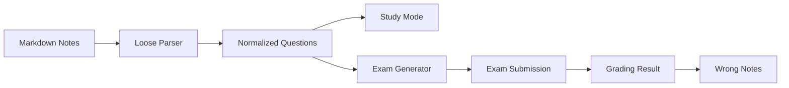

# active-recall-quiz

<div align="center">

### Markdown notes become a living question bank

[](https://nextjs.org/)
[](https://react.dev/)
[](https://fastapi.tiangolo.com/)
[](https://www.typescriptlang.org/)
[](https://www.python.org/)

정리해 둔 Markdown 학습 노트를 그대로 불러와  
문제 은행을 만들고, 시험을 생성하고, 서술형으로 채점하고, 오답노트까지 이어지는  
**Active Recall 기반 학습 앱**입니다.

</div>

---

## Why This Project

보통 시험 준비는 이렇게 끊깁니다.

- 노트는 Markdown으로 정리해둠
- 문제는 따로 만들어야 함
- 시험처럼 풀고 채점하는 흐름이 없음
- 틀린 문제를 다시 모아보기가 번거로움

이 프로젝트는 그 사이를 연결합니다.

> `Markdown note -> parser -> question bank -> exam session -> grading -> wrong notes`

즉, 이미 정리한 학습 자료를 다시 입력하지 않고도  
반복 회상 학습에 바로 연결할 수 있게 만드는 것이 목표입니다.

## Highlights

- `unit_*/*.md` 노트를 자동으로 읽어 문제 목록으로 변환
- FastAPI 기반 시험 생성, 제출, 채점 API 제공
- Next.js App Router 기반 학습/시험/결과/오답노트 화면 구성
- 단답형과 나열형 문제를 구분해서 채점
- 오답 결과를 프론트엔드 로컬 스토리지에 저장해 재복습 가능
- 현재 정처기 실기 스타일 학습 흐름에 맞춘 초기 MVP 형태

## Experience Flow



## Project Structure

```text
.
├── unit_*                  # 원본 학습 노트 markdown
├── backend                 # FastAPI API, parser, grading logic
│   ├── app
│   │   ├── api             # REST endpoints
│   │   ├── parsers         # markdown parser / normalizer / loader
│   │   ├── schemas         # pydantic models
│   │   ├── services        # question / exam / grading / stats
│   │   └── utils           # ids, text normalization
│   └── tests               # parser / grading tests
├── frontend                # Next.js UI
│   └── src
│       ├── app             # routes
│       ├── components      # UI components
│       └── lib             # API client, types, wrong-note storage
└── shared/openapi.json     # shared contract placeholder
```

## Key Screens

### 1. Home
- 단원 수와 파싱된 문제 수를 요약해서 보여줍니다.
- 학습 모드, 시험 모드, 오답노트로 바로 이동할 수 있습니다.

### 2. Study Mode
- 문제를 먼저 보고 답을 떠올린 뒤 정답을 확인하는 흐름입니다.
- 현재는 빠른 검증용 초기 버전이라 정답이 함께 노출됩니다.

### 3. Exam Mode
- 단원과 파트를 고른 뒤 시험 세트를 생성합니다.
- 생성된 문제를 서술형으로 입력하고 한 번에 제출합니다.

### 4. Result + Wrong Notes
- 정답 여부, 점수, 누락 키워드 중심으로 결과를 확인합니다.
- 틀린 문제는 오답노트로 저장해 다시 볼 수 있습니다.

## Markdown Question Format

현재 파서는 비교적 느슨한 규칙으로 동작합니다.

- `*`로 시작하는 줄: 문제 설명
- `->`로 시작하는 줄: 정답
- `*` 또는 `->` 다음 일반 텍스트 줄: 직전 항목에 이어 붙임
- 하나의 블록에 `->`가 여러 개 있으면: 나열형 문제로 취급
- 형식이 조금 어긋난 줄도: 경고를 남기고 최대한 계속 파싱

예시:

```md
* 소프트웨어 생명 주기를 설명하시오.
-> 소프트웨어 생명 주기

* 자료 흐름도의 특징을 쓰시오.
-> 자료의 흐름
-> 처리 과정
-> 데이터 저장소
```

## Tech Stack

| Layer | Stack |
| --- | --- |
| Frontend | Next.js 16, React 19, TypeScript |
| Backend | FastAPI, Pydantic, Uvicorn |
| Data Source | Local Markdown files |
| Persistence | In-memory exam/result store, browser localStorage |
| Testing | pytest |

## Run Locally

### 1. Backend

```bash
cd /Users/inchoi/prepareExam/backend
python3 -m venv .venv
source .venv/bin/activate
pip install -r requirements.txt
uvicorn app.main:app --reload
```

기본 서버:

- `http://127.0.0.1:8000`
- health check: `GET /health`

### 2. Frontend

```bash
cd /Users/inchoi/prepareExam/frontend
npm install
NEXT_PUBLIC_API_BASE_URL=http://127.0.0.1:8000/api npm run dev
```

프론트 주요 화면:

- `/study`: 학습 모드
- `/exam`: 시험 옵션 선택 후 시험 생성
- `/results/[examId]`: 채점 결과
- `/wrong-notes`: 오답노트

기본 프론트엔드:

- `http://127.0.0.1:3000`

## API Snapshot

### Read

- `GET /api/units`
- `GET /api/questions`
- `GET /api/questions/{questionId}?includeAnswer=true`
- `GET /api/exams/{examId}`
- `GET /api/exams/{examId}/result`
- `GET /api/stats/weakness`

### Write

- `POST /api/exams`
- `POST /api/exams/{examId}/submit`

## Test

```bash
cd /Users/inchoi/prepareExam/backend
pytest
```

현재 테스트는 아래 핵심 흐름을 확인합니다.

- 샘플 Markdown 파싱
- 단답형 채점 로직

## Current Architecture Notes

- 시험과 결과는 백엔드 메모리에 저장됩니다.
- 서버 재시작 시 시험 세션과 결과는 유지되지 않습니다.
- 오답노트는 브라우저 `localStorage`에 저장됩니다.
- 현재는 빠르게 반복 실험하기 좋은 MVP 구조입니다.

## Roadmap Ideas

- 정답 가리기 기반의 진짜 study mode 개선
- 문제 난이도/태그/단원별 가중치 출제
- 결과 영속화 및 사용자별 기록 저장
- OpenAPI 문서 자동 생성 및 `shared/openapi.json` 정리
- 오답노트 재시험 모드
- LLM 기반 유사 답안 채점 보조

## Repository Intent

이 저장소는 단순한 퀴즈 앱보다,  
**개인 학습 노트를 시험 가능한 인터랙티브 학습 시스템으로 바꾸는 실험**에 가깝습니다.

정처기 실기처럼 서술형 회상 연습이 중요한 시험을 준비할 때 특히 잘 어울립니다.
