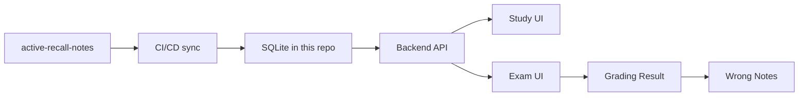

# active-recall-quiz

<div align="center">

### Markdown notes become a living question bank

[](https://nextjs.org/)
[](https://react.dev/)
[](https://fastapi.tiangolo.com/)
[](https://www.typescriptlang.org/)
[](https://www.python.org/)

이 저장소는 학습 노트를 직접 보관하는 곳이 아니라,  
`active-recall-notes` 저장소에서 가져온 데이터를 SQLite에 적재하고  
문제 생성, 시험 응시, 채점, 오답 복습 흐름을 제공하는 앱입니다.

</div>

---

## Overview

이 프로젝트의 핵심은 "노트 저장소"와 "학습 앱"의 책임 분리입니다.

- 노트 원본은 `active-recall-notes` 저장소에서 관리합니다.
- 이 저장소는 CI/CD로 동기화된 노트 데이터를 받아 SQLite에 저장합니다.
- 프론트엔드는 저장된 문제와 결과를 바탕으로 학습/시험 UX를 제공합니다.

즉, Markdown을 직접 읽는 앱이 아니라,  
외부 노트 레포를 데이터 공급원으로 삼는 학습 시스템입니다.

## Data Flow



## What This Repo Owns

- 노트 데이터의 수집 결과 저장
- 시험 세션 및 채점 API
- 학습/시험/결과 화면
- 오답 복습 경험

## What This Repo Does Not Own

- 노트 원본 작성
- 노트 콘텐츠의 장기 저장소 역할
- `unit_*` 기반 로컬 문서 저장소 역할

## Repository Structure

```text
.
├── backend
│   ├── app
│   │   ├── api
│   │   ├── parsers
│   │   ├── schemas
│   │   ├── services
│   │   └── utils
│   └── tests
├── frontend
│   └── src
│       ├── app
│       ├── components
│       └── lib
├── shared
└── README.md
```

## Key Screens

### 1. Study Mode
- 문제를 먼저 보고 답을 떠올린 뒤 정답을 확인합니다.
- 빠른 회상 연습을 위한 진입점입니다.

### 2. Exam Mode
- 단원과 파트를 기준으로 시험 세트를 생성합니다.
- 생성된 문제를 서술형으로 입력하고 제출합니다.

### 3. Result + Wrong Notes
- 정답 여부, 점수, 누락 키워드를 확인합니다.
- 틀린 문제는 오답노트로 이어집니다.

## Tech Stack

| Layer | Stack |
| --- | --- |
| Frontend | Next.js 16, React 19, TypeScript |
| Backend | FastAPI, Pydantic, Uvicorn |
| Data Source | `active-recall-notes` via CI/CD sync |
| Persistence | SQLite |
| Testing | pytest |

## Local Run

### Backend

```bash
cd /Users/inchoi/active_recall_quiz/backend
python3 -m venv .venv
source .venv/bin/activate
pip install -r requirements.txt
uvicorn app.main:app --reload
```

Backend defaults:

- `http://127.0.0.1:8000`
- health check: `GET /health`

### Frontend

```bash
cd /Users/inchoi/active_recall_quiz/frontend
npm install
NEXT_PUBLIC_API_BASE_URL=http://127.0.0.1:8000/api npm run dev
```

Frontend routes:

- `/study`
- `/exam`
- `/results/[examId]`
- `/wrong-notes`

## API Snapshot

### Read

- `GET /api/units`
- `GET /api/questions`
- `GET /api/questions/{questionId}?includeAnswer=true`
- `GET /api/exams/{examId}`
- `GET /api/exams/{examId}/result`
- `GET /api/stats/weakness`

### Write

- `POST /api/exams`
- `POST /api/exams/{examId}/submit`

## Current Direction

- 노트 원본은 외부 레포에서 관리합니다.
- 앱은 동기화된 노트 데이터를 바탕으로 학습 경험을 제공합니다.
- 내부 저장은 SQLite를 기준으로 맞춰갑니다.
- 로컬 Markdown 파일 의존은 점차 줄여갑니다.

## Notes

- 이 저장소는 학습 도구의 실행 계층에 집중합니다.
- 콘텐츠 운영과 이론 작성은 `active-recall-notes` 쪽에서 진행합니다.
