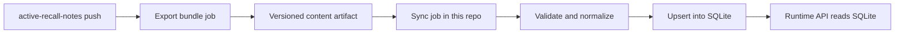

# Issue #32 Notes Sync Design

## Goal

This document defines how the backend should receive content from `active-recall-notes` and persist it into SQLite.
The target is to remove runtime dependence on local `unit_*` markdown files and replace it with an ingestion flow that is safe to retry and easy to version.

## Current State

- Runtime content loading scans local markdown files through a glob.
- Parsing and normalization happen inside the request-time service path.
- `unitId` and `questionId` are derived from file path conventions.
- API responses still reflect filesystem-shaped content.

## Recommended Direction

Use a two-step model:

1. `active-recall-notes` produces an immutable export bundle.
2. This repository imports that bundle into SQLite through a sync job.

That keeps content ownership in the notes repository while letting the quiz app own its local database and API runtime.

## Sync Flow

## Transport Options

### Option 1: Scheduled pull

This repository runs a scheduled job that fetches the latest export bundle from `active-recall-notes`.

Pros:
- Simple ownership model.
- This repo controls import timing and retry policy.
- Easy to keep the runtime database local.

Cons:
- Needs a reachable artifact source.
- Sync lag depends on schedule interval.

### Option 2: Repository dispatch or webhook trigger

`active-recall-notes` notifies this repository when a new export is ready.

Pros:
- Faster updates.
- Clear event-based handoff.

Cons:
- More moving parts.
- Harder to recover from missed notifications without a fallback pull.

### Option 3: Direct CI artifact handoff

The notes repo publishes an artifact, and this repo downloads it during CI/CD.

Pros:
- Strong version boundaries.
- Good fit for immutable snapshots.

Cons:
- Requires artifact retention policy and access control.

## Recommended Transport

Use an immutable artifact handoff with a fallback scheduled pull.

Reasoning:
- The notes repo can validate and package content once.
- The quiz repo can import only the tested artifact version.
- A scheduled pull gives us recovery if a push notification is missed.

## Bundle Contract

The export bundle should contain:

- `manifest.json` with bundle version, source commit, generated timestamp, and content hash.
- Normalized question records with stable ids.
- Unit and part metadata needed by the API.
- Optional raw source references for debugging.

The bundle should be treated as immutable after generation.

## Sync Semantics

- Import must be idempotent.
- The sync job should upsert by canonical content id, not by path.
- A sync run should be fully validated before it mutates the live dataset.
- If validation fails, the previous SQLite snapshot should remain active.
- Partial writes should be rolled back or written to a staging database first.

## Failure Handling

- Retry transient download or network failures with bounded backoff.
- Reject malformed bundles before touching runtime tables.
- Preserve the last known good SQLite state if a new import fails.
- Emit sync logs with source commit, bundle version, and failure reason.

## Versioning Strategy

- The notes repo should own the source commit hash.
- The export bundle should carry a monotonic bundle version or timestamp.
- The quiz repo should store the last applied bundle version in SQLite.
- Re-importing the same version should be a no-op.

## Migration Order

1. Define the export bundle schema in the notes repo.
2. Add a sync importer in this repository that writes to SQLite.
3. Move runtime question loading from markdown parsing to SQLite reads.
4. Keep the public API shape stable while the storage backend changes.
5. Remove local `unit_*` file discovery after the importer is fully validated.

## Risks

- If ids are generated differently between repos, exam history and weakness stats can drift.
- If the bundle is not immutable, sync runs may be non-reproducible.
- If the import path writes directly to production tables, a bad bundle can corrupt live content.
- If the API contract changes at the same time as storage, frontend updates become harder to coordinate.

## Tests To Add

- Bundle validation tests for required manifest fields.
- Import idempotency tests for repeated bundle application.
- Rollback tests for failed validation or failed writes.
- API contract tests proving the runtime shape stays stable after SQLite becomes the source of truth.

## Boundary With Other Work

- `#30` already maps the current `unit_*` dependency surface.
- `#31` should define the SQLite schema that this sync flow writes to.
- `#29` only needs attention if the response shape changes during migration.

