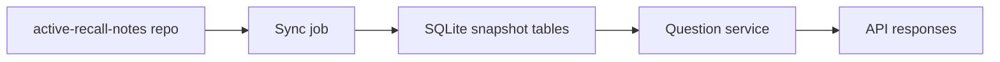

# SQLite Schema Design for External Notes Sync

이 문서는 `active-recall-notes` 저장소에서 수집한 학습 노트를 이 프로젝트의 SQLite에 적재하기 위한 설계 초안이다.

현재 구조는 `unit_*/*.md` 파일을 런타임에 직접 읽고, 메모리 캐시로 질문을 제공한다. 이 문서는 그 구조를 그대로 바꾸지 않고, `#30`과 `#32`에서 정리한 동기화 흐름을 받아들일 저장소 구조를 정의한다.

## Design Goals

- 원본 노트, 정규화된 질문, 동기화 메타데이터를 분리한다.
- 질문 API의 기존 응답 형태는 최대한 유지한다.
- 동기화는 덮어쓰기보다 스냅샷 기반 추적을 우선한다.
- `unit_*` 제거 이후에도 이전 결과를 추적할 수 있도록 히스토리를 남긴다.

## Current Flow

현재 백엔드는 다음 방식으로 동작한다.

- `backend/app/core/config.py`의 `content_glob`이 `unit_*/*.md`를 가리킨다.
- `backend/app/parsers/loader.py`가 markdown 파일을 나열한다.
- `backend/app/parsers/markdown_parser.py`가 원문 블록을 파싱한다.
- `backend/app/parsers/normalizer.py`가 질문 ID와 답안을 정규화한다.
- `backend/app/services/question_service.py`가 결과를 `lru_cache`로 메모리 캐시한다.

SQLite 전환 후에도 `QuestionDetail`과 `UnitSummary`의 응답 모양은 유지하는 것이 목표다.

## Suggested Tables

### `content_snapshots`

동기화 1회분을 나타내는 상위 메타데이터 테이블이다.

- `snapshot_id` TEXT PRIMARY KEY
- `source_repo` TEXT NOT NULL
- `source_commit` TEXT NOT NULL
- `importer_version` TEXT NOT NULL
- `synced_at` TEXT NOT NULL
- `is_latest` INTEGER NOT NULL DEFAULT 1

의도:

- 어떤 커밋에서 데이터가 들어왔는지 추적한다.
- 재수집 시 같은 원본인지 구분한다.

### `source_documents`

원본 markdown 파일 단위의 테이블이다.

- `document_id` TEXT PRIMARY KEY
- `snapshot_id` TEXT NOT NULL
- `source_path` TEXT NOT NULL
- `unit_id` TEXT NOT NULL
- `part` TEXT NOT NULL
- `title` TEXT
- `raw_markdown` TEXT NOT NULL
- `content_hash` TEXT NOT NULL
- `warning_count` INTEGER NOT NULL DEFAULT 0
- `is_active` INTEGER NOT NULL DEFAULT 1

권장 제약:

- `UNIQUE(snapshot_id, source_path)`
- `INDEX(source_path)`
- `INDEX(unit_id, part)`

의도:

- 노트 원문을 보존한다.
- 문서 단위의 존재 여부와 변경 이력을 남긴다.

### `question_records`

정규화된 질문 단위의 테이블이다.

- `question_id` TEXT PRIMARY KEY
- `document_id` TEXT NOT NULL
- `question_key` TEXT NOT NULL
- `ordinal` INTEGER NOT NULL
- `question_type` TEXT NOT NULL
- `prompts_json` TEXT NOT NULL
- `answers_json` TEXT NOT NULL
- `aliases_json` TEXT NOT NULL
- `keywords_json` TEXT NOT NULL
- `warnings_json` TEXT NOT NULL
- `source_line` INTEGER NOT NULL
- `normalized_hash` TEXT NOT NULL
- `is_active` INTEGER NOT NULL DEFAULT 1

권장 제약:

- `UNIQUE(document_id, ordinal)`
- `UNIQUE(question_key)`
- `INDEX(document_id)`
- `INDEX(question_type)`

의도:

- 현재 API가 사용하는 질문 단위를 그대로 저장한다.
- 정답, 별칭, 키워드처럼 배열 성격의 필드는 SQLite에서는 JSON 문자열로 저장한다.

## ID Strategy

권장 ID는 역할별로 나눈다.

- `snapshot_id`: `source_repo + source_commit`를 해시한 값
- `document_id`: `snapshot_id + source_path`를 해시한 값
- `question_id`: `source_path + ordinal + normalized payload`를 해시한 값
- `question_key`: 사람이 읽을 수 있는 공개 키로 유지할 값

설계 의도:

- 스냅샷은 동기화 배치를 식별한다.
- 문서는 파일 변경 단위를 식별한다.
- 질문은 내용이 바뀌면 새 식별자를 받을 수 있어야 한다.
- 공개 API에서는 기존의 `questionId` 호환을 우선하고, 내부 저장소는 해시 기반 중복 제거를 우선한다.

## Upsert Policy

- `content_snapshots`는 insert-only로 둔다.
- `source_documents`는 동일 스냅샷 내에서는 upsert한다.
- `question_records`는 `question_id` 기준으로 upsert한다.
- 원본에서 사라진 문서는 즉시 hard delete하지 않고 `is_active = 0`으로 남긴다.
- 질문도 동일하게 비활성화만 하고, 이력은 보존한다.

이 방식이 필요한 이유:

- 오답노트나 향후 시험 결과가 이전 질문을 참조할 수 있다.
- `unit_*` 삭제 이후에도 데이터 계보를 유지할 수 있다.

## Sync Rules

1. 새 스냅샷을 만든다.
2. `active-recall-notes`의 커밋 해시를 저장한다.
3. markdown 파일을 모두 읽어 `source_documents`를 갱신한다.
4. 문서별 질문을 정규화해 `question_records`를 갱신한다.
5. 최신 스냅샷에 없는 문서와 질문은 비활성화한다.
6. 모든 과정이 끝나야 `is_latest`를 최신 스냅샷으로 옮긴다.

## Transition From Memory Store

현재 메모리 기반 구조에서 SQLite로 바뀔 때는 다음 순서가 안전하다.

1. SQLite 스키마와 importer를 먼저 만든다.
2. `QuestionService`는 당분간 기존 메모리 로딩을 유지한다.
3. SQLite에서 동일한 `QuestionDetail`을 만들어 내는 확인 테스트를 추가한다.
4. API가 같은 응답을 유지하는 것이 확인되면 `lru_cache` 기반 로딩을 대체한다.
5. 마지막에 `unit_*` 파일 의존을 제거한다.

## Implementation Boundary

이 설계는 구현이 아니라 기준선이다.

- `#30`의 영향도 분석 결과를 통해 제거 대상 경로를 좁힌다.
- `#32`의 동기화 흐름 설계 결과를 통해 importer 입력을 확정한다.
- 이후에 SQLite schema migration, repository layer, API 교체 순서로 구현한다.

## Open Questions

- 질문의 공개 ID를 기존 `unitId:part:offset`으로 유지할지, 해시 기반으로 전환할지 결정이 필요하다.
- 삭제된 문서를 영구 보존할지, 일정 기간 후 압축 보관할지 결정이 필요하다.
- 정답/키워드 JSON 필드를 정규화 테이블로 더 쪼갤지는 추후 성능 요구를 보고 결정한다.
